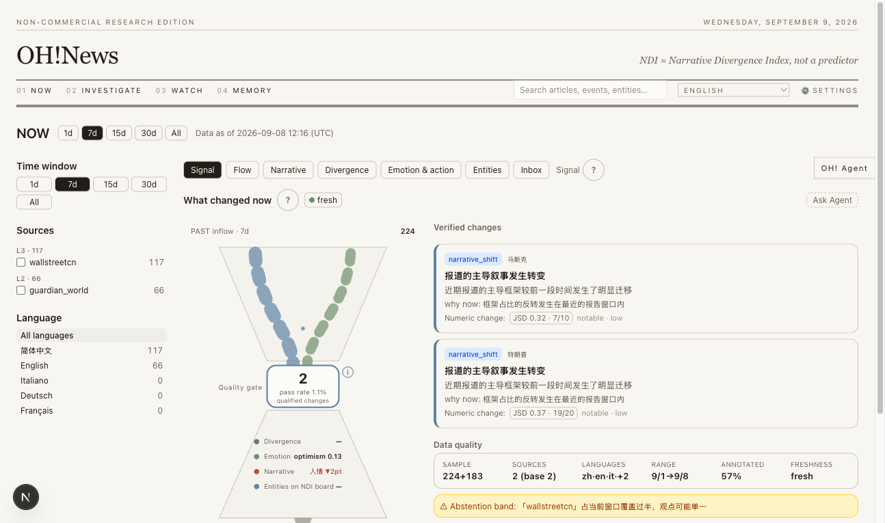
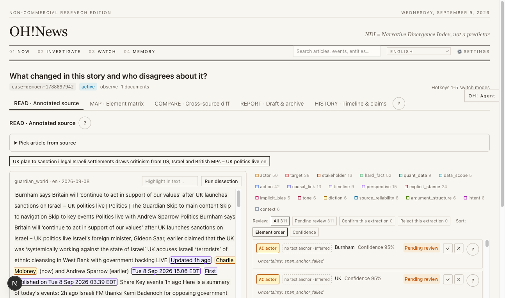
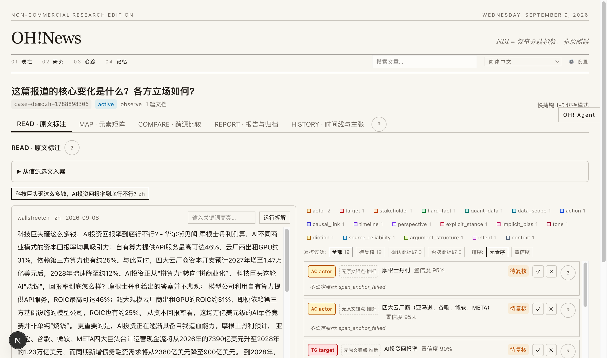
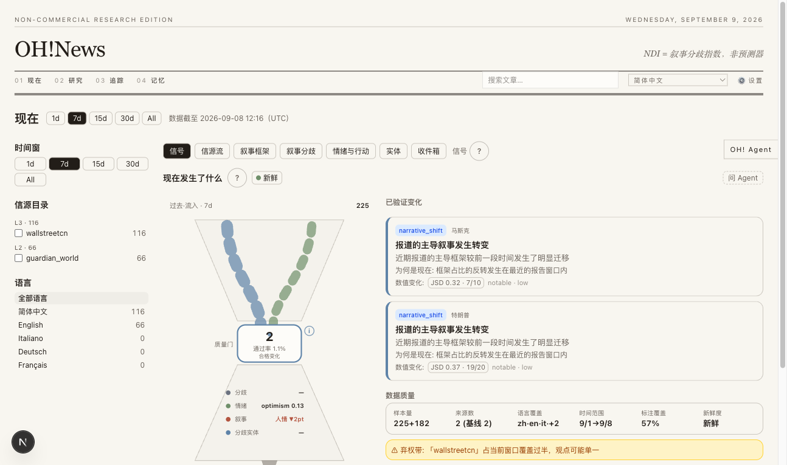
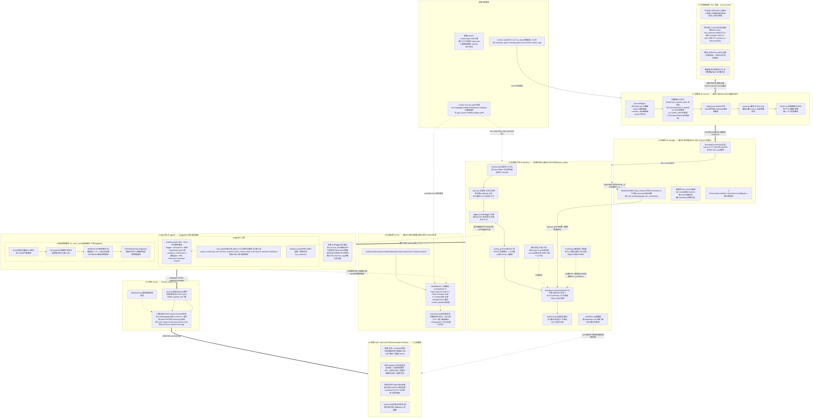

# OH!News

A cognitive-loop news intelligence terminal. English · [简体中文](README.zh.md)

**License**: [MIT](LICENSE) · Python 3.12+ · FastAPI · Next.js 16 · LangGraph · 627+ tests

## The problem

News consumption today breaks in three places:

1. **Changes are not trustworthy.** Aggregators show "what happened", but nothing tells you whether
   official and market narratives actually diverge — or whether a shift is just a change in source mix.
2. **Evidence is unreachable.** Claims reference "reports" you can never open. The path from a
   conclusion back to the original sentence in the original article is missing.
3. **Judgments leave no trace.** You read, you form a view, and three weeks later you cannot recall
   what you believed, on what evidence, or whether anything since should have changed your mind.

OH!News is built against these three breaks.

## Core concepts

**The cognitive loop.** The product is organized as a closed cycle, not a feed:

```
NOW (what changed) → INVESTIGATE (verify against evidence) → WATCH (track consequences)
→ MEMORY (archive what you confirmed) → back to NOW with a baseline
```

Each stage is a distinct surface with distinct obligations — discovery must be honest, verification
must be anchored, tracking must state what changed since your last review, and memory must contain
only what you explicitly confirmed.

**Honest measurement.** The Narrative Divergence Index (NDI) measures how far official-tier coverage
and market-tier coverage diverge on an event, using Jeffreys-smoothed frame distributions and
Jensen–Shannon distance with bootstrap confidence intervals. When either cluster lacks sufficient
independent sources, the system **abstains** — it reports "not measurable" rather than a fabricated
number. The same discipline applies everywhere: dissection falls back to a lexicon engine labeled
`offline` when the LLM is unavailable; missing days render as gaps, never interpolations; coverage
below a threshold raises a warning instead of being hidden.

**Anchored claims.** Every element the AI extracts (actor, hard fact, causal link, intent, …) carries
spans — exact character ranges in the original text. The reading view renders these as color highlights;
clicking one shows the element type. Coordinates are validated server-side (out-of-range or drifting
spans are discarded or re-anchored), so a highlight is always a quote, never a paraphrase.

**User-owned judgment.** Belief snapshots (stance + confidence + rationale) are written only on explicit
user confirmation. The system never revises a stored judgment, never converts a metric into a
recommendation, and never presents a model explanation as user belief.

**PIT discipline.** All pipeline queries are point-in-time: `*_asof` accessors guarantee that nothing
published after the as-of timestamp can leak into an answer. This makes results reproducible and the
demo dataset coherent.

## Screenshots

Demo dataset: 15 days of real news from two sources (English: *The Guardian*; Chinese: *Wallstreetcn*),
covering the full loop from inbox to memory. Full sets: [`docs/demo_en`](docs/demo_en),
[`docs/demo_zh`](docs/demo_zh).

Overview (English UI):



Annotated case reading (English UI):



Case reading (Chinese UI):



Overview (Chinese UI):



## Architecture



| Layer | Package | Responsibility |
|---|---|---|
| Ingestion | `oh-sources` | 7 adapters (RSS / GDELT / FRED / JSON / HTML / Playwright / Reddit-CDP), scheduled collection with per-source backoff, on-attach full-text fetch with deep cleaning |
| Semantics | `oh-pipeline` | Rule tagger (SVO, 6 domains × 13 directions), 8-emotion lexicon, event clustering (5-shingle Jaccard), NDI & temperature gap, four signal detectors, Intelligence Score ranking |
| Contracts | `oh-contracts` | Strict Pydantic models — the single source of truth; frontend types are generated from the FastAPI OpenAPI schema |
| Storage | `oh-storage` | SQLite stores (silver / research / annotations / translations) and Parquet bronze; point-in-time `*_asof` accessors |
| Agents | `oh-agents` | LangGraph graphs (dissection / report / translation / tracking / parent), belief, tracking and archive stores, product-event ledger |
| API | `oh-api` | FastAPI facade: briefing, change landscape, change field, cases, agents, chart aggregates |
| LLM | `oh-llm` | Three-tier model router (io / execute / strategic) with schema-validated structured output and candidate fallback |
| Web | `web` | Next.js 16, React 19, Tailwind 4, zero-dependency SVG charts, 21-language i18n |

## Quickstart

Prerequisites: Python 3.12+ with [uv](https://docs.astral.sh/uv/), Node 20+, and optionally an LLM API
key. Without keys the system runs end-to-end with the lexicon engine and template reports.

```bash
# 1. Backend
uv sync
uv run python scripts/dev/serve.py --port 8787

# 2. Frontend
cd web && npm install && npx next dev -p 3001

# 3. Model keys (optional; also configurable in Web UI → Settings → API Keys)
export DEEPSEEK_API_KEY=sk-...    # io tier
export ZHIPU_API_KEY=...          # execute / strategic tiers
export TAVILY_API_KEY=tvly-...    # agent web search

# 4. Collect and build
uv run python scripts/dev/cron_collect.py --days 15   # collect, then auto-annotate
uv run python scripts/dev/run_daily.py --days 15      # events, stances, NDI

# 5. Open http://localhost:3001
```

### Environment variables

| Variable | Required | Purpose |
|---|---|---|
| `DEEPSEEK_API_KEY` | no | io-tier LLM (JSON-mode structured output) |
| `ZHIPU_API_KEY` | no | execute / strategic tiers |
| `TAVILY_API_KEY` | no | agent web search |

## Tutorial: one full loop

1. **Observe** (`/observe`) — seven panels: signals, source flow, narrative frames, divergence, emotion
   and action, entities, inbox. Every panel renders each day of the selected window; missing days are
   marked, not skipped.
2. **Investigate** (`/investigate`, `/cases`) — pick an inbox item, create a case. The system fetches
   the full text (scripts and boilerplate stripped), dissects it into 18 element types anchored to
   character spans, and produces research reports (veracity, intent, attribution, narrative, trend,
   structured summary) on demand.
3. **Watch** (`/watch`) — create tracking units for an entity, a topic, a question, or an article
   element (for example `tone:optimism`). Each unit answers "what changed since my last review", with
   the review date explicit.
4. **Archive** (`/archive`) — only items you confirm are stored. Archive items can be composed into an
   editorial "paper" with a foreword.
5. **Judge** — on any change page, record your stance (maintain / adjust / reverse / uncertain) and
   confidence. The belief timeline is append-only and never rewritten by the system.

## What is not built (and could be)

The current release is a single-user, non-commercial research build. The following are deliberate
omissions with clear extension paths:

- **Semantic retrieval.** Search is substring-based over bronze; no embeddings, no FTS5 index. The
  annotation store is the natural substrate for a bge-small-style local embedding layer (M3-S4 in the
  original plan, deferred), which would unlock element-level and emotion-level similarity search.
- **LLM incremental annotation.** The lexicon layer covers 100% of articles by construction; an LLM
  pass on the subset the lexicon cannot parse (negation, sarcasm, implicit stance) would raise stance
  quality. The contract already distinguishes `engine=lexicon|llm`.
- **Knowledge graph temporal edges.** The entity-edge store records co-occurrence, hierarchy and
  relation edges with first/last-seen, but there is no time-sliced graph traversal or graph database.
  Projecting edges per NDI window would make narrative diffusion observable.
- **Belief updating as a model.** Belief snapshots are stored and diffed, but the system does not model
  belief revision (e.g. Bayesian update against new evidence). Deliberately so: the loop must not
  optimize itself toward changing the user's mind.
- **Multi-user and auth.** Single user; no accounts, no sync. The store layer is already keyed by
  session in the event ledger, which is the natural hook.
- **Streaming ingestion.** Collection is batch/cron. A streaming path (webhooks, RSS pubsub) would
  reduce the freshness lag that the freshness indicator currently surfaces honestly.
- **Cross-language alignment automation.** Translations are LLM-generated with deterministic
  proper-noun checks, but cross-language claim alignment (the same fact reported in two languages) is
  manual. This is the largest research-sized gap in the product.
- **NDI as a causal instrument.** NDI is a divergence measure, not a predictor — the UI states this.
  Extending it toward causal attribution (which source cluster moved the divergence) is open.

## Repository layout

```
packages/          uv workspace: oh-contracts / oh-sources / oh-pipeline / oh-storage /
                   oh-agents / oh-api / oh-llm
web/               Next.js 16 frontend (App Router)
scripts/dev/       serve / run_daily / cron_collect / backfill tooling
docs/              RECONSTRUCTION.md (design decisions, M1–M6 milestones) · ARCHITECTURE_MAP.md ·
                   demo_en/ demo_zh/ (full-loop screenshots)
data/              runtime SQLite + Parquet bronze (not committed)
```

## Testing

```bash
uv run pytest -q          # 627+ tests across packages
cd web && npx tsc --noEmit && npx eslint .
uv run ruff check packages scripts
```

## License

[MIT](LICENSE). Non-commercial research edition. News content belongs to its original publishers;
OH!News stores metadata, short snippets and derived annotations for research purposes only.
