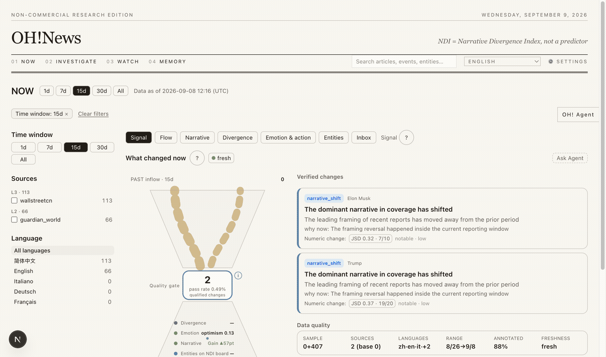
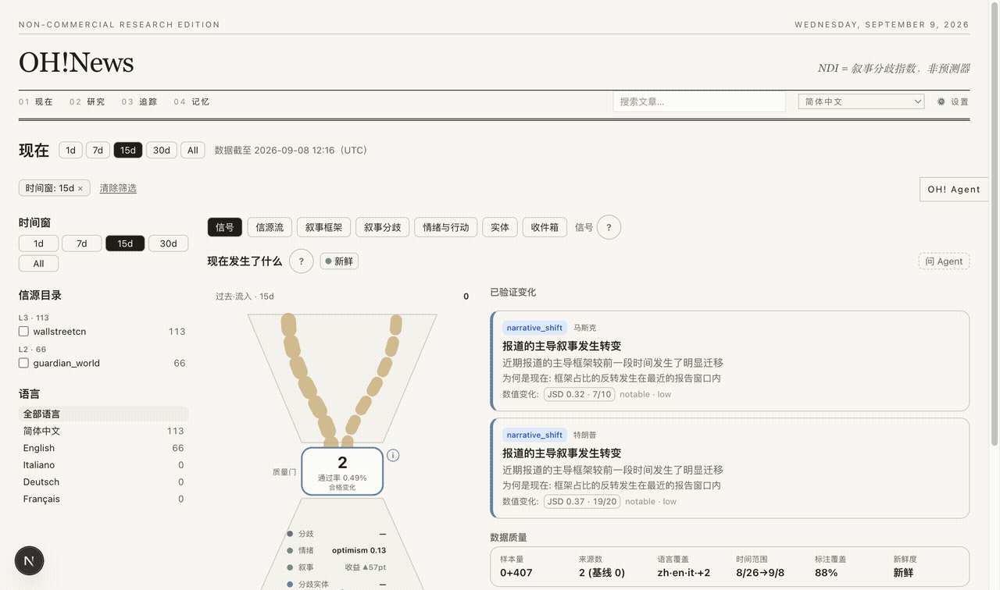
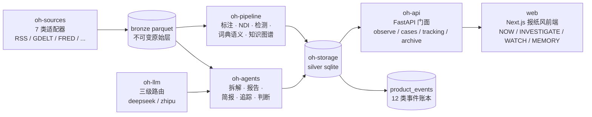

# OH!News

认知闭环的新闻情报终端。简体中文 · [English](README.md)

**许可**：[MIT](LICENSE) · Python 3.12+ · FastAPI · Next.js 16 · LangGraph · 627+ 测试

## 问题

今天的新闻消费在三个地方断裂：

1. **变化不可信。** 聚合器告诉你「发生了什么」，却没有任何东西告诉你：官方与市场的叙事是否真的
   出现分歧——或者你以为的「转变」只是来源构成的改变。
2. **证据不可达。** 结论引用「据报道」，但你永远打不开那条报道。从结论回到原文原句的路径是缺失的。
3. **判断不留痕。** 你读完、形成看法，三周后无法回忆自己当时相信什么、依据是什么、之后出现的
   信息是否本应改变它。

OH!News 针对这三个断裂而建。

## 核心概念

**认知闭环。** 产品按闭环组织，而不是信息流：

```
现在（什么变了）→ 调查（对证据验证）→ 追踪（跟踪后果）
→ 记忆（存档你确认过的东西）→ 带着新基线回到现在
```

每个阶段是独立的界面，承担不同的义务——发现必须诚实、验证必须有锚、追踪必须说明「自你上次
复核以来变了什么」、记忆里只有你显式确认过的内容。

**诚实测量。** 叙事分歧指数（NDI）度量同一事件上官方级报道与市场级报道的分歧程度：对两簇的
框架分布做 Jeffreys 平滑，计算 Jensen–Shannon 距离并给出 bootstrap 置信区间。当任一簇的独立
信源不足时，系统**弃权**——报告「不可测」而不是编造一个数字。同样的纪律贯穿全系统：LLM 不可用
时拆解回退到标注为 `offline` 的词典引擎；缺测日期以断线呈现，绝不插值；覆盖率低于阈值时给出
警告而不是掩盖。

**有锚的论断。** AI 提取的每个元素（主体、核心事实、因果链、发布动机……）都携带 spans——原文中
精确的字符区间。阅读视图将其渲染为颜色高亮；点击任一高亮即显示元素类型。坐标在服务端校验
（越界或漂移的 span 被丢弃或重锚定），所以每个高亮都是原文引用，而非转述。

**用户所有的判断。** 认知快照（立场+信心+理由）只在用户显式确认后写入。系统不会修订已存的判断，
不会把指标转成建议，也不会把模型解释冒充为用户信念。

**PIT 纪律。** 管道查询全部是时点查询：`*_asof` 访问器保证任何晚于 as-of 时刻发布的内容不会泄入
答案。这使结果可复现、demo 数据集自洽。

## 演示

两条完整走查（英文语料一条、中文语料一条），各走通 收件箱 → 研究 → 追踪 → 记忆 全流程，录制成 GIF：





高清截图：[`docs/demo_en`](docs/demo_en)、[`docs/demo_zh`](docs/demo_zh)。


## 架构

数据单向流动：信源采集进不可变 bronze 层，管道把原始文本变成被测量的信号，agent 与 API
组装证据，网页呈现。全链 SQLite，除 LLM 供应商外无外部基础设施。



认知闭环四阶段对应四个路由：NOW 呈现合格变化，INVESTIGATE 打开带锚定证据的变化档案，
WATCH 追踪实体与元素，MEMORY 保存判断史与研究档案。


## 快速开始

前置：Python 3.12+ 与 [uv](https://docs.astral.sh/uv/)、Node 20+，可选一个 LLM API Key。
没有 Key 系统照样端到端运行（词典引擎 + 模板报告）。

```bash
# 1. 后端
uv sync
uv run python scripts/dev/serve.py --port 8787

# 2. 前端
cd web && npm install && npx next dev -p 3001

# 3. 模型 Key（可选；也可在网页 ⚙ 设置 → API Keys 配置）
export DEEPSEEK_API_KEY=sk-...    # io 层
export ZHIPU_API_KEY=...          # execute / strategic 层
export TAVILY_API_KEY=tvly-...    # agent 联网搜索

# 4. 采集与构建
uv run python scripts/dev/cron_collect.py --days 15   # 采集，随后自动标注
uv run python scripts/dev/run_daily.py --days 15      # 事件/立场/NDI

# 5. 打开 http://localhost:3001
```

### 环境变量

| 变量 | 必须 | 用途 |
|---|---|---|
| `DEEPSEEK_API_KEY` | 否 | io 层 LLM（JSON 模式结构化输出） |
| `ZHIPU_API_KEY` | 否 | execute / strategic 层 |
| `TAVILY_API_KEY` | 否 | agent 联网搜索 |

## 教程：走完一个闭环

1. **观察**（`/observe`）——七个面板：信号、信源流、叙事框架、叙事分歧、情绪与行动、实体、
   收件箱。每个面板对所选窗口的每一天渲染；缺测日有标记，不会跳过。
2. **调查**（`/investigate`、`/cases`）——收件箱选一篇，建 case。系统抓取全文（剔除脚本与模板
   噪音），拆解为 18 类元素并锚定字符区间，按需产出研究报告（真实性核查/意图动机/归因因果/
   叙事框架/动态趋势/结构化摘要）。
3. **追踪**（`/watch`）——为实体、主题、问题或文章元素（如 `tone:optimism`）建跟踪单元。
   每个单元回答「自上次复核以来发生了什么」，复核日期显式呈现。
4. **存档**（`/archive`）——只有你确认的才入库。档案可组合成一份带编者按的「档案报纸」。
5. **下判断**——在任何变化页记录立场（维持/调整/反转/不确定）与信心。认知时间线只增不改，
   系统永不改写。

## 尚未实现（可拓展方向）

当前版本是单用户、非商业的研究构建。以下是刻意留白的部分，均有一条清晰的拓展路径：

- **语义检索。** 搜索目前是对 bronze 的子串匹配；没有 embedding，没有 FTS5 索引。标注库是
  bge-small 级本地 embedding 层的天然底座（原计划 M3-S4，已推迟），落地后可解锁元素级、
  情绪级的相似检索。
- **LLM 增量标注。** 词典层按构造覆盖 100% 文章；对词典无法解析的子集（否定、反讽、隐含立场）
  加一轮 LLM 标注可以提升立场质量。契约已区分 `engine=lexicon|llm`。
- **知识图谱时序边。** 实体边库记录共现/层级/关系边及首末见时间，但没有时间切片的图遍历，
  也没有图数据库。按 NDI 窗口投影边可以让叙事扩散可观察。
- **作为模型的信念更新。** 认知快照已存储并可 diff，但系统不对信念修正建模（例如对新证据做
  贝叶斯更新）。这是刻意的：闭环不应朝着「改变用户想法」的方向自我优化。
- **多用户与鉴权。** 单用户；无账号、无同步。埋点账本已按 session 键控，是天然的挂点。
- **流式采集。** 采集是批量/cron。流式路径（webhook、RSS pubsub）可以缩短新鲜度指示器当前
  诚实呈现的时滞。
- **跨语言对齐自动化。** 翻译由 LLM 生成并做确定性专名校验，但跨语言论断对齐（同一事实在两种
  语言中的报道对齐）仍是人工。这是产品里最大的研究级空白。
- **NDI 作为因果工具。** NDI 是分歧度量，不是预测器——界面如此声明。向因果归因拓展
  （哪个来源簇移动了分歧）是开放问题。

## 仓库结构

```
packages/          uv workspace：oh-contracts / oh-sources / oh-pipeline / oh-storage /
                   oh-agents / oh-api / oh-llm
web/               Next.js 16 前端（App Router）
scripts/dev/       serve / run_daily / cron_collect / backfill 工具
docs/              RECONSTRUCTION.md（设计决策，M1–M6 里程碑）· ARCHITECTURE_MAP.md ·
                   demo_en/ demo_zh/（全流程截图）
data/              运行时 SQLite + Parquet bronze（不入库）
```

## 测试

```bash
uv run pytest -q          # 全仓 627+ 测试
cd web && npx tsc --noEmit && npx eslint .
uv run ruff check packages scripts
```

## 许可

[MIT](LICENSE)。非商业研究版。新闻内容版权归原发布方所有；OH!News 仅存储元数据、
摘要片段与派生标注，用于研究目的。
