# OH!News 大型流程架构图（v2，2026-08-28）

> 一图总览：L0 外部源 → L1 采集 → L2 存储 → L3 处理统计 → L4 Agent → L5 API → L6 前端三主体 + 运维配置层。
> 业务与技术逻辑匹配：每条关键边标注对应蓝图裁决（A/C/D/E/F/H）与数据契约。
> 渲染：https://mermaid.live （源码见下方代码块）

```mermaid
flowchart TB
  %% ============ L0 外部数据源 ============
  subgraph EXT["L0 外部数据源（52+ 活源，sources.yaml）"]
    direction LR
    ZH["中文组:L1统计央行/L2新华人民网/L3财联社新浪东财快讯/L4知乎热榜"]
    EN["英文组:L1 Fed-ECB-BoE演讲稿(feds_notes-boe_speeches 20k全文)/L2 BBC-Guardian-TASS/L3 WSJ-CNBC-FT-Livemint/L4 HN-StockTwits"]
    AGG["聚合:GDELT(zh/en切片回填+代理回退) + FRED(央行序列快照)"]
    SENS["敏感壳:BPC抓取壳公开/本地配置gitignored(裁决G)"]
  end

  %% ============ L1 采集层 ============
  subgraph SRC["L1 采集层 oh-sources —— 裁决C:纯Python无LLM确定性ETL"]
    direction LR
    ADAPTER["SourceAdapter ABC(base.py):令牌桶60rpm+指数退避+window_days稀疏窗+proxy+双hash"]
    SEVEN["7适配器:rss(全文detail)/json_api(dot_path+多词轮询)/html/gdelt(slice_days切片)/fred(快照语义)/reddit_cdp(CDP登录门)/browser(Playwright渲染壳)"]
    REG["registry.py:enabled开关(false零开销)+fallbacks备用链解析"]
    RUN["runner.py:重试≤3+item_key幂等去重+collect_all顺序确定性"]
    HLTH["health.py:四维健康分(成功率/产出/重复/新鲜度)→<0.3自动降级"]
    ADAPTER --> SEVEN --> REG --> RUN --> HLTH
  end

  %% ============ L2 存储层 ============
  subgraph STORE["L2 存储层 oh-storage —— 裁决D:单进程SQLite WAL,Protocol可换PG"]
    direction LR
    BRONZE["BronzeWriter:Parquet分区source/YYYY/MM/DD+zstd+同日合并+item_key幂等"]
    SILVER["SqliteStore(WAL+busy_timeout=5000):events(as_of PIT锚)/stances(UNIQUE幂等)/ndi_series(language+low_confidence)"]
    AUXDB["旁路库:null_events(跨语言)/chat(线程)/intel(台账)/alerts(触发去重)/decisions(决策日志)"]
    PROT["三Protocol:BronzeWriter/SilverStore/GoldReader→换PG零改码"]
  end

  %% ============ L3 处理统计层 ============
  subgraph PIPE["L3 处理统计层 oh-pipeline —— NDI数学核心(裁决A:NDI只来自stance_table)"]
    direction LR
    ENT["entities.py:28实体+父子关系(Fed⊃FOMC)+词边界匹配(防SEC⊂second)"]
    RULES["rules.py:五框架+正负立场线索词表(codebook v0近似)+置信n/(n+2)封顶<0.75"]
    TAG["tagger.py RuleTagger:文章级stance行+弃权语义(无信号不产行)"]
    EV["events.py EventBuilder:实体×UTC日窗聚合→门(≥3篇×≥2源)+event_id幂等"]
    DIV["divergence.py:Dirichlet(α=0.5)平滑+加权JSD+样本门N≥10+bootstrap CI+ΔT温差+lang_map分语言"]
    ANAT["anatomy.py分歧构成:簇分布/簇对JSD(官方-市场标记)/主体对立表"]
    DERIV["展示派生(只读,不进NDI):spectra.py句级光谱+svo.py词级主体-动作(六域十三方向)"]
    XL["crosslang.py跨语言门禁(裁决F):null集D₀基线+τ95+四条件gate(当前LOCKED)"]
    VAL["validation.py测量效度:Spearman ρ≥0.8硬门禁(未过禁对外数字)"]
    ENT --> RULES --> TAG --> EV --> DIV --> ANAT
    DERIV -. "只读派生" .-> DIV
  end

  %% ============ LLM 路由层 ============
  subgraph LLML["LLM 路由层 oh-llm —— 裁决E:自研元数据+路由,契约=schema不变"]
    direction LR
    MYAML["config/models.yaml:providers(deepseek/zhipu/openrouter/ollama/custom)"]
    ROUTER["ModelRouter:三级路由 io=DeepSeek V4 Flash/execute=GLM-5.3-Flash/strategic=GLM-5.3+fallback链+并发Semaphore(3)+重试+model_validate后校验"]
    COMM["committee.py标注委员会:双模型独立标注→JSD分歧门0.4→第三模型裁决→Krippendorff α(live实测0.8783)"]
    MYAML --> ROUTER --> COMM
  end

  %% ============ L4 Agent 层 ============
  subgraph AGENT["L4 Agent层 oh-agents —— langgraph三图+固定编排"]
    direction TB
    subgraph GRAPHS["langgraph 三图"]
      direction LR
      AGA["analysis_graph:plan→Send并行事件管线(tagger→divergence→校准→hypothesis_gen只读→evidence_interpreter)→置信gate→HITL interrupt/Command resume"]
      AGC["chat_graph多轮对话:agent⇄tools条件边循环+6只读工具(query_events/get_ndi/retrieve_evidence/fetch_online/draft_brief/search_entities)+ChatStore线程+5轮上限+离线降级"]
      AGR["research_graph问诊:只读工具集→答案合成(run_research)"]
    end
    subgraph INTEL["六角色情报循环 run_intel_cycle(固定顺序,不走langgraph)"]
      direction LR
      SC["Scout侦查员:量级z≥3/新实体/CUSUM节奏漂移"]
      CAR["Cartographer制图师:实体共现网络+度中心度+hubs"]
      RT["RedTeam:ACH竞争假设×证据矩阵(+1/0/-1,结论本地裁决不信LLM,离线机械降级)"]
      CH["ChiefAnalyst:KeyJudgments强制ICD203七档概率语言+禁预测措辞"]
      SC --> CAR --> RT --> CH
    end
    SUPP["支撑:LLMTagger官方簇补盲/morning_brief晨报(24h分歧变化TopN)/alerts预警(NDI历史分位P80-95+同实体每日1次)/decision_log决策日志回填"]
  end

  %% ============ L5 API 层 ============
  subgraph API["L5 API层 oh-api —— FastAPI单进程+SSE"]
    direction LR
    EP["17端点组:health/status/events(NDI时序)/ndi(language过滤)/evidence一键引用/spectrum句级/anatomy分歧构成/brief/research/decisions/alerts/chat多轮/intel(run+latest)/dev/logs"]
    SSE["stream:进程内asyncio事件总线(零Redis)+Last-Event-ID语义+publish_sse广播"]
    DASH["dashboard.py:服务端渲染兜底页"]
    EP --- SSE
    DASH -.-> EP
  end

  %% ============ L6 前端三主体 ============
  subgraph WEB["L6 前端 web/ Next.js16+Tailwind+shadcn+ECharts —— 三主体重组"]
    direction LR
    MON["监测:总览/·command动态大屏(框架河流/源星系/NDI心电/事件二部图)/alerts"]
    ANA["分析:analyze工作台递进五段(结论→分歧构成簇对JSD→主体对立表→词级光谱联动过滤→证据引用)"]
    RES["研究AGENT:agent双tab(情报对话ChatPanel+情报巡逻IntelPanel:KJ卡片/ACH矩阵/实体网络)"]
    EVT["events/[id]详情:NDI时序+叙事光谱(句染+词级span)+证据链"]
  end

  %% ============ 运维层 ============
  subgraph OPS["运维与配置层"]
    direction LR
    CFG["config/:sources.yaml(52源tier/language/enabled/fallbacks)/codebook五框架操作化/gold_set(α=0.8783)/models.yaml"]
    SCR["scripts/:backfill(入口)/run_daily全链编排(--llm开关)/annotate_gold/crosslang_gate/serve/probe/collect_logs"]
    DPLY["部署:docker-compose(api+web已冒烟)/CI三OS矩阵/opencode三级路由模板/.specify SDD+宪法"]
  end

  %% ============ 关键业务-技术匹配边 ============
  EXT ==>|"适配7种协议,幂等主键source:external_id:ts(裁决C)"| SRC
  SRC ==>|"Draft双hash落分区,重复写written=0"| BRONZE
  BRONZE -->|"iter_records全文"| PIPE
  SILVER -->|"stances_asof:NDI唯一数据源(裁决A)"| DIV
  PIPE ==>|"StanceRow+NDIPoint(as_of日末锚PIT t-1)"| SILVER
  PIPE ==>|"事件/NDI/anatomy供上下文"| AGENT
  AGENT ==>|"langgraph stream updates+messages"| SSE
  SSE --> EP
  EP ==>|"JSON/SSE rewrites代理"| WEB
  AGENT -.->|"LLM调用全走三级路由,缺keys自动降级离线"| ROUTER
  TAG -.->|"官方簇程式化文本命中低→LLMTagger补盲"| AGA
  VAL -.->|"ρ≥0.8前NDI=描述性指数(措辞纪律)"| WEB
  XL -.->|"null集<50→跨语言LOCKED强制low_confidence"| DIV
  SCR -->|"cron/手动驱动"| SRC
  CFG -.->|"tier_map+lang_map+watchlist注入"| PIPE
  CFG -.->|"provider/tier/契约测试"| ROUTER
  DPLY -.-> OPS
```

## 分级功能清单（图中节点 ↔ 文件）

| 层级 | 业务能力 | 技术落点 |
|---|---|---|
| L0 | 经济金融信息源全覆盖（官方/通讯社/财媒/社媒/聚合） | `config/sources.yaml`（52+ 源） |
| L1 | 确定性采集、幂等、限速、自动降级 | `oh-sources/*`（7 适配器+registry+runner+health） |
| L2 | 三层数据仓库（不可变 Bronze/业务 Silver/指标 Gold）+旁路库 | `oh-storage/*`（parquet 分区 + sqlite WAL） |
| L3 | NDI 数学核心+分歧构成+句级/词级派生+跨语言门禁+效度验证 | `oh-pipeline/*`（divergence/anatomy/spectra/svo/crosslang/validation） |
| LLM | 三级模型路由+fallback+契约后校验+标注委员会 | `oh-llm/*` + `config/models.yaml` |
| L4 | 分析图/对话/问诊/六角色情报循环/晨报/预警/决策日志 | `oh-agents/*`（langgraph 三图+intel_cycle） |
| L5 | 17 端点+SSE 流式+日志监控 | `oh-api/*` |
| L6 | 三主体前端（监测/分析/研究） | `web/app/*` |
| 运维 | 配置/脚本/部署/CI/SDD | `config/`+`scripts/`+`docker/`+`.github/`+`.specify/` |
