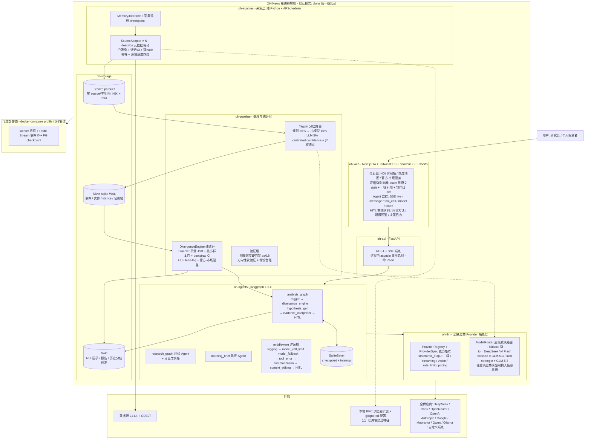
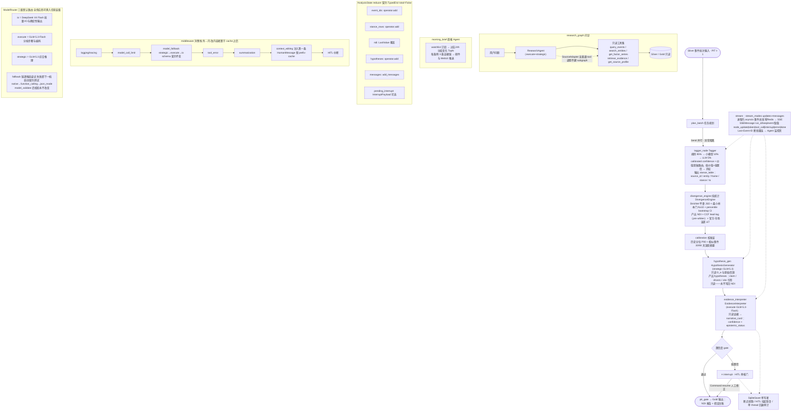
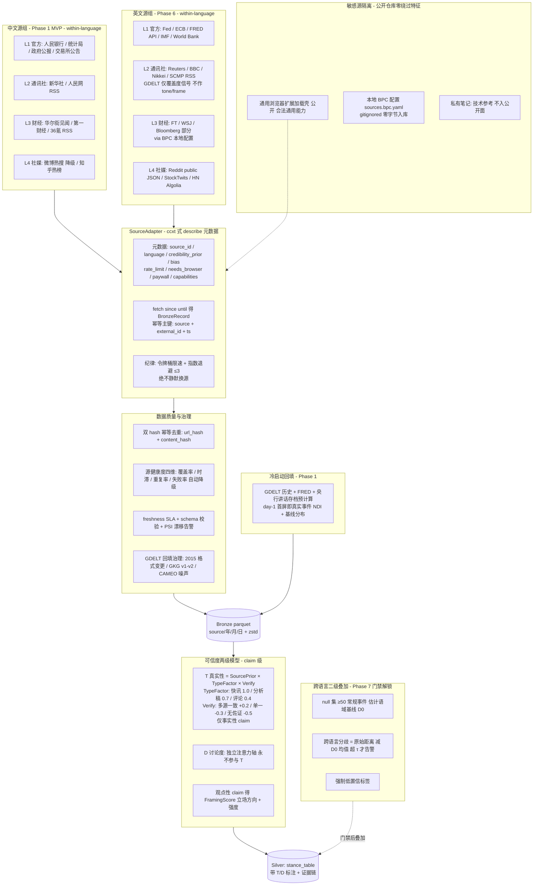

# OH!News 蓝图 v2（BLUEPRINT）

> **版本**：v2.0（五专家两轮辩论裁决版）
> **日期**：2026-08-27
> **状态**：已确认（Latte 确认全部细节），作为 Phase 0 基线
> **决策来源**：14 项目研究（langchain/langgraph/deepagents/deer-flow/TradingAgents/ccxt/qlib/freqtrade/AI-Trader/ai-hedge-fund/Finkg/Orange-Hourglass/sea-leads/OH!News v1）+ 五专家两轮辩论（业务/技术/架构/研究员/数据科学家 → 8 组冲突仲裁裁决 A-H）
> **三张架构图**：源码内嵌于本文档 §4/§5/§6，可在 mermaid.live 交互修改
> **红线**：非商业用途；不输出买卖指令；输出=分析+风险信号+置信度+证据链

---

## 1. 项目定位与差异化

**OH!News = Agent 原生的市场叙事情报台**。把经济/金融及其政治/文化/社会关联领域的公开叙事，变成**可验证、可溯源、可跨源比较**的数据资产——量化栈缺的"为什么层"。

- **信号内核**：叙事分歧指数 **NDI**（Narrative Divergence Index）——同一事件在官方/市场化媒体/社媒等信源簇之间的立场与框架分布差异，纯统计计算，LLM 只做假设生成与证据解释（裁决 A）。
- **社科方法论落地**：框架理论（Entman）→ 框架标注；议程设置（McCombs & Shaw）→ 议题显著性 lead-lag；批判话语分析（Fairclough）→ 官方-市场话语温差。方法论经 codebook+gold set 效度门禁后才对外展示（§9）。
- **对比既有项目**：
  - TradingAgents：有过程无数据资产 → 本项目持续积累 Bronze/Silver/Gold；
  - GDELT：有覆盖无跨源立场比较 → 本项目 NDI 为核心增量，GDELT 仅作覆盖度信号；
  - Perplexity 类：可引用无自有资产 → 本项目证据链绑定 PIT 时间轴与历史分位校准；
  - Finkg：有叙事无 agent 架构 → 本项目 langgraph 多图 + 中间件 + HITL。
- **留存引擎**：晨报 Agent（watchlist+每日分歧变化+证据链）+ 决策日志（记录判断→回填结果=个人资产+校准数据）。

---

## 2. 八项裁决（辩论最终结论）

### 裁决 A — 辩论层：删除对抗性 Narrator
删除 Bull/Bear 对抗辩论。LLM 降级为**假设生成器 + 证据解释器**，永不写回分歧度量。
**不变量**：`D_e = 各信源簇 stance 分布间 JSD`，数据仅来自 `stance_table`；任何 LLM 输出只读。
拓扑：`source_ingest → tagger（规则85%/小模型10%/LLM5%）→ stance_table → divergence_engine（纯统计）→ D_e(t) → hypothesis_gen（LLM 只读）→ evidence_interpreter（LLM 只读）→ narrative_card{confidence, epistemic_status} → pit_gate → 输出`。

### 裁决 B — 验证框架：三效度分离
| 效度 | 性质 | 目标变量 | 门禁 |
|---|---|---|---|
| 测量效度 | **硬门禁** | 人工标注的跨源框架分歧 ground truth（**不是价格**） | 系统 D_e 与标注 **Spearman ρ ≥ 0.8**（50 事件，LLM 预标+人工复核，标注者只看原始信源防锚定；单人 2-4 周） |
| 方向性 | 软门禁 | \|意外度\| / 后续波动 | 20-30 已知结果事件；失败不阻断上线，进假设台账；触及价格类目标才启用 purge/embargo/Deflated Sharpe |
| 认知价值 | UX 验证 | 找证据耗时 / 证据链引用率 | 前后对照 |

**措辞纪律（写死 README）**：默认称谓="叙事分歧指数 NDI"（描述性监测）；升格"雷达信号"唯一条件=测量效度 ρ≥0.8 通过且预注册；**永不使用"预测器/择时"**；UI 强制标注"EPU 式条件变量，非收益预测器"。

### 裁决 C — 采集层：纯 Python，不用 langgraph
采集=非 LLM 确定性 ETL。`SourceAdapter(ABC)`：`source_id` + `fetch(since, until)` + `to_bronze(raw) → BronzeRecord(source_id, item_key, fetched_at, raw, normalized)`；幂等主键 `item_key=(source, external_id, ts)`；`CollectorRegistry`；runner 重试=3 指数退避。research 图内取源数据当普通 tool 调用，不建 subgraph。

### 裁决 D — 进程拓扑：单进程起步
默认**单进程**：FastAPI + AsyncIOScheduler + langgraph 同进程（单写者消解并发冲突，用进程拓扑而非 PG 消解）。checkpoint=`langgraph-checkpoint-sqlite`；APScheduler=MemoryJobStore（job 静态配置启动重建）；SSE=进程内 asyncio 事件总线（每 client 一个 Queue）；业务 SQLite 连接工厂统一 `journal_mode=WAL; busy_timeout=5000; synchronous=NORMAL`。
**可选部署态**：`docker-compose.prod.yml`（profile 激活）worker + Redis Stream + PG，checkpoint 换 `langgraph-checkpoint-postgres`（同库不同 schema）。Repository/Checkpointer 已抽象，切换代码零改。
**升级触发（写入 README）**：①多 worker/多用户 ②单库>1GB ③SQLITE_BUSY 超阈 ④需全文检索（先试 FTS5）。

### 裁决 E — Provider 抽象层：自研元数据+路由
自研 ProviderRegistry + ModelRouter；复用 langchain `init_chat_model` 仅做模型构造。OpenRouter 降级为普通 OpenAI 兼容端点（显式 model id），禁用 Auto/Provider 聚合语义。
- `SOStrategy` 三级：native / function_calling / json_mode。
- `Capabilities`：structured_output(frozenset[SOStrategy]) / streaming / tool_calling / vision / context_window / rate_limit(rpm,tpm) / pricing(in,out 每 1M)。
- **fallback 契约 = 输出 schema 而非策略**：按 tier 顺序尝试每个 (provider/model, strategy)，每次传同一 Pydantic model；策略可逐模型降级，但输出 schema 与后校验（`model_validate`）永不改变。失败判定=超时/限流/解析校验失败 → 下一候选。默认策略 function_calling。
- **契约测试**：启动时对每个 (provider, model) 跑 Claim→Evidence 嵌套 schema 夹具（required/enum 保真），结果缓存决定有效 strategy；`contract_test: false` 可跳过。
- **支持全部主流供应商**：OpenAI / Anthropic / Google / DeepSeek / Zhipu / OpenRouter / Moonshot / Qwen / MiniMax / xAI / Mistral / Ollama / OpenAI 兼容自定义端点；三级调度只是默认路由策略，任意供应商模型可换入任意层级。详见 §7。

### 裁决 F — 跨语言：三级门禁
Phase 1 MVP 仅中文 within-language（官方 vs 市场化 vs 社媒，同语域内算分歧）→ Phase 6 英文 within-language 独立管线 → Phase 7 跨语言二级叠加。
**语域基线归零**：用无实质分歧常规事件（Fed 决议符合预期/例行 CPI/PMI）作 null 集，估计官方-官方跨语种编辑语域差异分布 D₀（情态/语态/确定性标记向量距离）；≥50 null 事件后取 D₀ 95 分位为阈值 τ。
**解锁门禁（全部满足）**：①中英 within-language 各稳定 ≥4 周 ②null 集 ≥50 事件且 D₀ 分布 σ 收敛 ③跨语言分歧=原始距离−D₀均值，仅超 τ 告警 ④所有跨语言信号强制低置信标签。未达门禁前 README 不得宣传跨语言为卖点。

### 裁决 G — zlibrary/BPC：四层分级
| 层级 | 允许内容 |
|---|---|
| 公开仓库 | 无任何 zlibrary/BPC 链接或绕过规则；只保留抓取壳与合法源 |
| 公开文档/README | 同上，仅泛称"付费源经合法渠道获取" |
| 私有笔记 | zlibrary/BPC 技术参考，标注"内部非商业、禁止分发" |
| 敏感模块 | 永不入库、gitignore、仅本地 |

**BPC 隔离原则：代码与数据分离**——仓库只放接受配置的抓取壳（通用浏览器扩展加载能力，合法通用）；绕过规则/站点清单作运行时本地注入文件 `sources.bpc.yaml`（gitignored，仓库零字节）；本地用户自备配置、责任自担。

### 裁决 H — 可信度：双轴分离
- **T 真实性** = `SourcePrior(source) × TypeFactor(article_type) × Verify(corroboration)`，仅对事实性 claim 计算。TypeFactor：快讯 1.0 / 分析稿 0.7 / 评论专栏 0.4；Verify：多源交叉一致 +0.2 / 单一信源 −0.3 / 无独立佐证 −0.5。
- **D 讨论度** = 独立注意力轴，永不参与 T。
- 观点性/解释性 claim 不产真值分数，改产 **FramingScore**（立场方向+强度），不喂入 T。
- 信源适用性矩阵：Reuters/AP 快讯 D 中 T 高；Reuters 分析稿 D 低 T 中降权；人民网/官方 D 低 T 高（立场真实非独立真值）；微博/X 热搜 D 高 T 近零；社媒 KOL D 高 T 零。
- 初版静态权重 0.9/0.4 废弃。

---

## 3. 第一轮直接采纳提案（无冲突清单）

1. **冷启动历史回填**：GDELT 30 年 + FRED + 央行讲话存档预计算，day-1 首屏即真实事件 NDI + 基线分布。
2. **晨报 Agent**：watchlist 订阅 → 过去 24h 分歧变化 TopN，每条附 3 条证据链。
3. **决策日志模块**：用户记录"据此判断 X"→ 事后回填结果 Y（个人资产 + 校准数据）。
4. **信号校准层**：裸分数 → "0.7（该事件类型近 5 年 P90）" + 相似事件 30/90 天演变摘要。
5. **codebook + gold set**：每框架 10-20 句例句+反例，500-1000 句标注，Krippendorff α>0.7 才上线；输出逐句概率分布（多标签 softmax/多人同意率），禁止单点硬比例。
6. **实体 canonical registry**：entity_id + Wikidata QID + 多语言别名 + 父子关系边（**Fed ≠ FOMC**，父-子关系）；blocking（type+surface form+共现）后再 embedding；建消歧评估集报 precision/recall@k。
7. **统计层公式全套**：见 §8。
8. **路由双轴**：calibrated confidence（Platt/isotonic）× 价值；τ1=0.9 走规则，τ2=0.5 走小模型；仅"高价值∧低置信"走 LLM，低价值+低置信**弃权**（NA 语义）。
9. **GDELT 定位**：仅覆盖度信号（什么在被报），不作 tone/frame。
10. **SSE 事件结构**：`SSEMessage{run_id, seq, event: node_update|token|tool_call|interrupt|error|done, node, payload}` + Last-Event-ID 断线重连。
11. **版本策略**：锁 `langgraph ~=1.2.11` + `uv.lock`；补丁用**行为探测**（FeatureProbe：probe() 为真=上游已修复→告警移除补丁）而非版本号比较；CI 加 compat-matrix 任务。
12. **新增 oh-llm 独立包**：provider 抽象+router，仅依赖 oh-contracts；oh-pipeline 与 oh-agents 都依赖它。
13. **CI 三级矩阵**：Linux 全量（含 playwright）/ macOS 单元+核心集成 / Windows 单元+关键路径冒烟（不跑浏览器）；pytest marker `sensitive` 默认 skip（敏感 repo 传 `--run-sensitive`）。
14. **Bronze 分区**：`source/YYYY/MM/DD` + zstd + row_group_size=1e6；日级小文件 polars 按天重写合并；Bronze 永久保留。
15. **三套工作流模板**：晨会 30 分钟（12h 越阈值 Top5+证据链，无 LLM 叙事）/ 周报（lead-lag 表+框架迁移）/ 深度专题（单政策链条纵向导出）。
16. **证据链一键引用**：每 claim 卡"复制引用"→ [原文摘录]+[来源机构]+[PIT 发布时间]+[可信度]+[原文链接/偏移]；"较昨日"diff 视图。
17. **Agent 合并**：Framing/Agenda/Discourse 三分析师并入 tagger 管线 + divergence_engine 统计层；最终 8 类 Agent 名册（§5.2）。

---

## 4. 系统架构（图1：整体架构逻辑图）



---

## 5. Agent 设计架构

### 5.1 图2：Agent 设计架构图



> 图2 为原版丢失后按裁决 A/C/E 拓扑忠实重建，已在 mermaid.live 渲染验证（零语法错误）。

### 5.2 Agent 名册（8 类，11 类精简而来）

| Agent | 模型层级 | LLM | 输入 | 输出契约 | 职责 |
|---|---|---|---|---|---|
| Collector ×N | 无 LLM | — | 调度触发（since, until） | `BronzeRecord[]` | 确定性源采集（SourceAdapter，裁决 C） |
| Tagger | 规则85%/小模型10%/LLM5% | io 层兜底 | CuratedItem 批 | `stance_table(source_id, entity, frame, stance, ts)` + calibrated confidence | 分层路由标注；低价值+低置信弃权 |
| DivergenceEngine | 纯统计 | **零 LLM** | stance_table | `NDI + CI + lead-lag + 温差 ΔT` | JSD 计算，样本门+弃权语义 |
| HypothesisGenerator | strategic | GLM-5.3 | D_e + 原始信源（只读） | `hypotheses[{claim, drivers, cite[]}]` | 假设生成；**永不写回 NDI** |
| EvidenceInterpreter | execute | GLM-5.3-Flash | 证据（只读） | `narrative_card{confidence, epistemic_status}` | 证据解释 + 认知状态标注 |
| MorningBriefAgent | execute | GLM-5.3-Flash | watchlist | 晨报（分歧变化+3 条证据链） | 留存引擎 |
| ResearchAgent | execute+strategic | GLM-5.3-Flash / GLM-5.3 | 用户问题 | 调查报告（带证据链引用） | 问诊；只读工具集 |
| Reviewer | 人类 | — | 低置信产物 | approve / reject / flag | HITL 审核门（interrupt 驱动） |

### 5.3 langgraph 设计细节

- **State 契约**：`TypedDict(total=False)` + **真 reducer**（禁用纯注释 Annotated 用法）：`event_ids: operator.add`、`stance_rows: operator.add`、`ndi: LastValue`、`hypotheses: operator.add`、`messages: add_messages`、`pending_interrupt`。
- **Send 并行**：显式 input/output 映射；每分支外层 try/except → 返回降级结果（error_marker），异常不跨 superstep 传染。
- **循环控制**：辩论类循环用 `Command(goto)` 显式路由 + 轮数硬上限，防死循环。
- **interrupt/resume**：`value = interrupt(payload)`；恢复 `graph.ainvoke(Command(resume={...}), config)`。
- **middleware 洋葱序（外→内）**：`logging/tracing → model_call_limit → model_fallback（strategic→execute→io，schema 契约不变）→ tool_error → summarization → context_editing（注入第一条 HumanMessage 保 prefix-cache）→ HITL`。规则：改内容者的中间件置于 cache 之后。
- **stream**：`stream_modes=["updates","messages"]` → 进程内 asyncio 事件总线（零 Redis）→ SSE → Agent 监控页。
- **checkpoint**：SqliteSaver（单写者）；断点续跑 / HITL 挂起恢复 / 单 thread 回退（timetravel 仅此用途；叙事演化回放走数据层 PIT 查询+快照表）。
- **BaseStore 推迟**：v1 用 checkpointer+显式表；出现真实跨 thread 语义检索需求再上。
- **版本策略**：`langgraph ~=1.2.11` + uv.lock；FeatureProbe 行为探测补丁 + CI compat-matrix。

---

## 6. 数据源组合架构

### 6.1 图3：数据源组合架构图



> 注：原版 tab 中 "SCMA" 为笔误，本文档已更正为 SCMP。

### 6.2 SourceAdapter 契约（裁决 C 签名）

```python
@dataclass(frozen=True)
class BronzeRecord:
    source_id: str
    item_key: str          # 幂等主键 = (source, external_id, ts)
    fetched_at: datetime
    raw: dict
    normalized: dict

class SourceAdapter(ABC):
    source_id: str
    async def fetch(self, since: datetime, until: datetime) -> list[dict]: ...
    def to_bronze(self, raw: dict) -> BronzeRecord: ...

class CollectorRegistry:
    def register(self, a: SourceAdapter) -> None: ...
    def get(self, source_id: str) -> SourceAdapter: ...
    def all(self) -> list[SourceAdapter]: ...
```

纪律：每源令牌桶限速 + 指数退避 ≤3；双 hash（url_hash+content_hash）幂等；源健康度四维自动降级；**绝不静默换源**（全链失败返回 NO_DATA 哨兵，如实上报）。

### 6.3 采集层运行时

APScheduler（AsyncIOScheduler，MemoryJobStore）每源一 job；采集游标 checkpoint（崩溃续采）；misfire_grace_time=3600 + coalesce=True + max_instances=1。调度器线程经 `run_coroutine_threadsafe` 桥接进程内事件总线。

---

## 7. oh-llm Provider 抽象层（裁决 E 详述）

```python
class SOStrategy(StrEnum):
    NATIVE = "native"; FUNCTION_CALLING = "function_calling"; JSON_MODE = "json_mode"

@dataclass(frozen=True)
class Capabilities:
    structured_output: frozenset[SOStrategy]
    streaming: bool; tool_calling: bool; vision: bool
    context_window: int
    rate_limit: tuple[int, int] | None      # (rpm, tpm)
    pricing: tuple[float, float] | None     # (in, out) 每 1M tokens

@dataclass(frozen=True)
class ModelSpec:
    provider: str; model_id: str
    context_window: int; max_output: int
    structured_output: frozenset[SOStrategy]; rate_limit: ...; pricing: ...

@dataclass(frozen=True)
class ProviderSpec:
    name: str; base_url: str | None; api_key_env: str | None
    extra: dict; models: dict[str, ModelSpec]; capabilities: Capabilities

class ProviderRegistry:
    def register(self, s: ProviderSpec) -> None: ...
    def get(self, name: str) -> ProviderSpec: ...
    def refs(self, tier: Tier) -> list[ModelRef]: ...

class ModelRouter:
    def __init__(self, registry, routing: dict[Tier, list[ModelRef]], contract: SchemaContract): ...
    async def invoke(self, tier: Tier, prompt: str, schema: type[BaseModel] | None) -> Any: ...
```

**models.yaml（默认路由，全部供应商可换入）**：

```yaml
defaults: {strategy: function_calling, max_retries: 3, contract_test: true}
providers:
  deepseek:
    base_url: https://api.deepseek.com
    api_key_env: DEEPSEEK_API_KEY
    models: {deepseek-v4-flash: {context_window: 128000}}
  zhipu:
    base_url: https://open.bigmodel.cn/api/paas/v4
    api_key_env: ZHIPU_API_KEY
    models: {glm-5.3: {}, glm-5.3-flash: {}}
  openrouter:
    base_url: https://openrouter.ai/api/v1
    api_key_env: OPENROUTER_API_KEY
    models: {z-ai/glm-5.3-flash: {}}        # 显式 model id，禁用 Auto 聚合语义
  anthropic:
    api_key_env: ANTHROPIC_API_KEY
    models: {claude-sonnet-4: {}}
  openai:
    api_key_env: OPENAI_API_KEY
    models: {gpt-5.2: {}}
  google:
    api_key_env: GEMINI_API_KEY
    models: {gemini-3-pro: {}}
  moonshot:
    base_url: https://api.moonshot.cn/v1
    api_key_env: MOONSHOT_API_KEY
    models: {moonshot-v1-flash: {}}
  ollama:
    base_url: http://localhost:11434/v1
    api_key_env: null
    models: {qwen2.5: {context_window: 32768}}
  custom:
    base_url: ${OPENAI_COMPAT_BASE_URL}
    api_key_env: MY_KEY
    models: {any: {}}
routing:
  io:        {primary: deepseek/deepseek-v4-flash, fallback: [moonshot/moonshot-v1-flash]}
  execute:   {primary: zhipu/glm-5.3-flash,        fallback: [deepseek/deepseek-v4-flash]}
  strategic: {primary: zhipu/glm-5.3,            fallback: [anthropic/claude-sonnet-4]}
```

> 待实现确认项：Zhipu provider 已加入 opencode（auth.json），产品侧确切 model id 以 Zhipu 官方文档为准（`glm-5.3` / `glm-5.3-flash` 占位）。

---

## 8. 统计层规范（DivergenceEngine）

| 指标 | 公式 | 门禁/检验 |
|---|---|---|
| 热度 | `H_t(e) = log(1 + Σ_s c_s · Σ_a e^{−λ(t−t_a)})`，c_s=可信度×偏差折扣 | λ 可配 |
| 框架分布平滑 | `P̂_s(f) = (n_{s,f} + α) / (N_s + Kα)`，α=0.5（Jeffreys） | — |
| 分歧 NDI | 加权 JS 散度 `D_JS = H(Σ_s π_s P̂_s) − Σ_s π_s H(P̂_s)`，π_s=源权重 | **最小样本门 N_min=10**（任一源不足→弃权 NA）；percentile bootstrap CI（≥1000 次），CI 过宽→低置信标记；升级路径=层级贝叶斯 shrinkage |
| 温差 | `ΔT = Σ_f |P_official(f) − P_market(f)|` | 另出带符号方向版 |
| lead-lag | 双序列 ARIMA 残差互相关（pre-whiten），t=0 对齐发布时刻 | CCF + block bootstrap 显著性带；禁止裸写"X 领先 Y" |
| 比例类 | 一律 **Wilson 区间** | 禁止正态近似 |
| 漂移监控 | `PSI = Σ(A_i−E_i)·ln(A_i/E_i)` | PSI>0.1 告警 |
| 路由校准 | calibrated confidence（Platt/isotonic） | τ1=0.9 规则 / τ2=0.5 小模型；高价值∧低置信才走 LLM |

数据质量：freshness SLA（max(ts)−now 超阈告警）+ schema 校验 + PSI 漂移；源健康度=覆盖率×去重率×时滞×失败率。

---

## 9. 验证框架与措辞纪律

见 §2 裁决 B 三效度表。补充纪律：

- **因子墓地台账**：所有假设预注册；失败率诚实披露（接弃权语义）。
- **验证与 Gold 同步**：Phase 1 建 codebook+gold set（LLM 预标+人工复核，标注者只看原始信源不看 LLM 解释，消除锚定偏误）。
- **UI 措辞**：默认"叙事分歧指数 NDI（EPU 式条件变量，非收益预测器）"；升格"雷达信号"唯一条件=测量效度 ρ≥0.8 通过且预注册。
- purge/embargo/Deflated Sharpe/BH-FDR **仅在触及价格类目标时启用**。

---

## 10. 模块结构与依赖规则

```
OHnews/
├── packages/
│   ├── oh-contracts/   # Pydantic 契约/枚举/常量（零依赖底座，CI 禁 import 业务包、禁 IO）
│   ├── oh-llm/         # Provider 抽象 + ModelRouter（仅依赖 contracts）
│   ├── oh-storage/     # 仓储接口 BronzeWriter/SilverStore/GoldReader + SQLite 实现（PG 留 adapter TODO）
│   ├── oh-sources/     # SourceAdapter 框架 + 免费源适配器 + 抓取壳
│   ├── oh-pipeline/    # Tagger/实体 registry/统计层/验证层（依赖 storage+sources+llm）
│   ├── oh-agents/      # langgraph 图 + prompts + middleware（依赖 contracts+storage+llm）
│   ├── oh-api/         # FastAPI 传输+鉴权+校验（依赖 agents；禁 import 节点内部）
│   ├── oh-web/         # Next.js 14（HTTP 访问 api）
│   └── oh-devtools/    # opencode 日志隔离 + 监控（只读观测）
├── config/             # sources.yaml / credibility.yaml / models.yaml
├── scripts/            # setup.sh + setup.ps1 + doctor 自检
├── specs/              # spec-kit SDD 产物
├── docs/               # 本蓝图 + ADR
├── .specify/           # spec-kit 框架（已初始化）
└── .opencode/          # gitignored（防凭据泄漏，见 .gitignore）
```

**依赖方向（单向，无环）**：`oh-contracts` 零依赖 ← `oh-storage`/`oh-sources`/`oh-llm`；`oh-pipeline → storage+sources+llm`；`oh-agents → contracts+storage+llm`；`oh-api → agents`；`oh-web →(HTTP) api`；`oh-devtools` 只读。Silver 业务 schema 归 oh-contracts，存储层不反噬业务。

---

## 11. 进程拓扑与存储

见 §2 裁决 D。要点：单进程默认（FastAPI + AsyncIOScheduler + langgraph 同进程）；SQLite 统一 PRAGMA（WAL/busy_timeout=5000/synchronous=NORMAL）；web 只读、worker（若有）独占写；docker-compose.prod.yml profile 提供部署态（worker+Redis Stream+PG）；升级触发四条件写入 README。

---

## 12. CI 与质量门禁

- **三级矩阵**：Linux 全量（含 playwright）/ macOS 单元+核心集成 / Windows 单元+关键路径冒烟（文件锁/路径/setup.ps1；不跑浏览器）。
- **sensitive marker**：默认 skip；敏感 repo 传 `--run-sensitive`。
- **compat-matrix**：升级 langgraph minor 前跑 4 类图 golden e2e。
- **QA Gate**：`ruff check --fix && ruff format` → `pytest -v` → 安全自查（无硬编码密钥、无注入）→ 必要时 code-reviewer/security-reviewer 复查。
- 新手配置：`scripts/setup.sh`（macOS/Linux）/ `setup.ps1`（Windows）：uv sync → playwright install → doctor 自检 → 可选 BPC 本地配置路径。

---

## 13. Phase 0-7 计划与验收门禁

| Phase | 内容 | 验收门禁 |
|---|---|---|
| **0 地基** | repo/uv workspace/oh-contracts/oh-storage 仓储接口/CI 三级矩阵/敏感壳+本地配置注入/opencode 项目配置+日志隔离 | 10 合成事件管线 sanity；CI 绿；doctor 通过 |
| **1 采集+回填** | SourceAdapter 框架/5-8 中文免费源/GDELT+FRED 回填/源健康度/**codebook+gold set** | 7 天连续采集无人工干预；回填 day-1 首屏真实 NDI+基线 |
| **2 处理+统计** | Tagger 分层路由/实体 registry/统计层 JSD+样本门+CI/证据链/PIT 审计 | **测量效度硬门禁 ρ≥0.8**；抽取 F1 达标；证据可回溯 |
| **3 分析+LLM** | analysis_graph（hypothesis_gen+evidence_interpreter）/晨报/校准层/决策日志 | 方向性软验证（失败进假设台账） |
| **4 Agent 编排** | research_graph/HITL/checkpoint/SSE 事件总线 | 断点续跑演示；interrupt/resume 演示 |
| **5 WebUI** | 仪表盘/证据链浏览器（一键引用+diff）/Agent 监控/审核队列/三套工作流模板 | 三 OS 本地跑通 |
| **6 预警+英文源+部署态** | 预警订阅（watchlist+阈值+历史分位）/英文 within-language/docker-compose profile | 英文管线与中文对称稳定 ≥4 周 |
| **7 跨语言解锁** | null 集 ≥50/语域基线 D₀/二级叠加 | 三级门禁全满足（§2 裁决 F）；未达不发布 |

---

## 14. SDD 工作流（spec-kit）

已初始化：`specify init --here --force --integration opencode`（2026-08-27，specify 0.12.9.dev0，sh 脚本类型）。产物：`.specify/`（模板+脚本+constitution 模板）+ `.opencode/commands/speckit.*` 10 命令。

每 Phase 循环：`/speckit.constitution`（一次性，五原则：Spec-First / Idempotent / Compliance-First / Verification / Modularity + Non-Commercial）→ `/speckit.specify` → `/speckit.clarify` → `/speckit.plan` → `/speckit.tasks` → `/speckit.analyze` → `/speckit.implement` → `/speckit.converge`；QA Gate 收尾。

---

## 15. opencode 开发环境集成

- **开发时三级模型路由**（项目级 `opencode.json` 覆盖全局；zhipu provider 已在 opencode auth.json，确切 model id 实现时确认）：
  | opencode agent | 模型 |
  |---|---|
  | plan / architect / code-reviewer / security-reviewer / agent-evaluator | GLM-5.3（zhipu 直连） |
  | build / build-error-resolver / debugger / tdd-guide | GLM-5.3-Flash（openrouter） |
  | explore / docs-lookup / doc-updater / 批量 I/O | deepseek-v4-flash |
- **日志隔离**：oh-devtools 将 `~/.local/share/opencode/projects/<本项目hash>/` 会话 JSON 镜像到项目内 `.opencode/logs/`（gitignored）。
- **监控 WebUI**：oh-web 开发态路由 `/dev/monitor`——读取镜像日志 + 订阅产品 agent SSE 流，展示 message/tool_call/schema/model 参数/token 计数/interrupt 队列；`scripts/dev/monitor.sh` 一键启动开浏览器。
- **skills**：langchain-architecture、prompt-engineering-patterns、python-project-structure、python-testing-patterns、data-scraper-agent、uv-package-manager、webapp-testing。

---

## 16. 合规与红线

1. **非商业用途声明**（README + LICENSE）；不构成投资建议。
2. **不输出买卖指令**：输出=深度分析+风险信号+置信度+证据链。
3. **四层分级**（裁决 G）：公开仓库零 zlibrary/BPC 关联；抓取壳只接受本地配置；`sources.bpc.yaml` gitignored 零字节入库；私有笔记永不入公开面。
4. 主流免费源尊重 robots/ToS：限速+幂等+失败退避；绝不静默换源。
5. `.opencode/` 全目录 gitignore（specify 安全提示：防凭据泄漏）。

---

## 17. 诚实声明

1. **NDI 预测力无文献支持**：现有文献（Da/Engelberg/Gao 搜索量、Tetlock 媒体情绪、Garz 框架流行度）均不直接支持"跨源分歧→目标变量"；本产品定位 EPU 式描述性监测，预测性声明被措辞纪律禁止。
2. **框架测量先过效度门**：codebook+gold set+α>0.7 未通过前，框架占比数字不对外展示（否则是伪精度）。
3. **跨语言是方法论最脆弱特性**：语域 artifact 风险真实存在，故设三级门禁，未解锁不作卖点。
4. **单人+免费约束**：50 事件标注需 2-4 周人工；HITL 无团队时可能成瓶颈（橡皮图章风险）；LLM API 是持续净支出，靠三级路由+分层 NLP+内容寻址缓存控制。
5. **GDELT 回填自带偏差**：2015 格式变更/GKG v1-v2/CAMEO 误码/早期非英语覆盖偏差，跨期比较需谨慎。
6. **snapshot 类结论均基于静态阅读**，行号/版本以实现期实测为准。

---

## 18. 决策历史索引

- v1 蓝图（11 Agent 辩论版）→ 五专家第一轮评审（5 份独立报告，P0-P2 分级）→ 三场交叉仲裁（裁决 A-H）→ v2 蓝图（本文档）。
- 三张架构图经 pako URL 在 mermaid.live 打开并渲染验证；图2 原版丢失后按裁决拓扑重建并验证。
- 全部已确认项：删除 Bull/Bear（裁决 A）/ 代码与数据分离（G）/ 单进程起步（D）/ zlibrary 公开面零关联（G）/ NDI 措辞纪律（B）/ Phase 0-7 计划。
